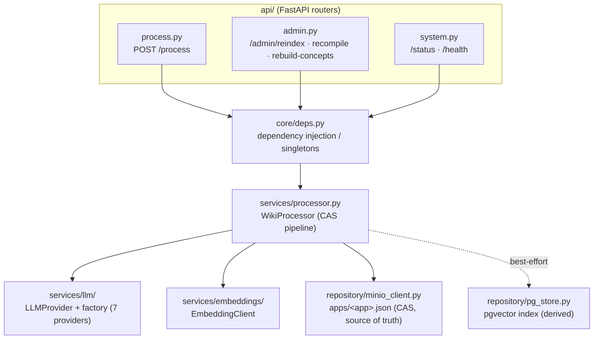
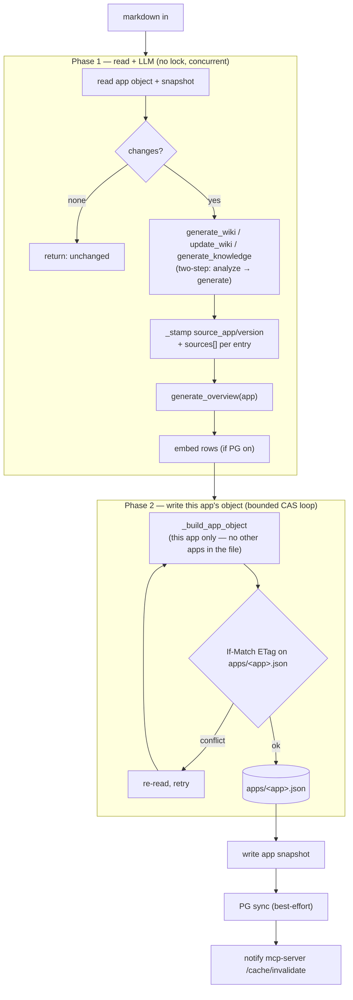

# wiki-processor —— 架構

匯入 + 索引服務。分層：`api/`（HTTP）→ `core/`（DI 依賴注入）→ `services/`（邏輯）
→ `repository/`（MinIO + PG）。

> 名詞：**DI（dependency injection，依賴注入）** = 由外部把相依物件傳進來，便於替換/測試；
> **CAS** = ETag 樂觀鎖；**每-app 物件** = `apps/<app>.json`，一次推送只寫自己的（P3）。

## 內部分層

## /process pipeline（兩階段，多 replica 安全）

> P3：寫入只動該 app 自己的物件（O(1)，各 app 各自一把 CAS 鎖、無全域鎖、不互卡）。
> 彙總 `wiki.json`（concepts/overviews + 合併視圖）由 `/admin/rebuild-concepts` 按需重建。

CAS 契約見 [`docs/concurrency.md`](../concurrency.md)；LLM 層見
[`docs/llm-provider-abstraction.md`](../llm-provider-abstraction.md)；端點見
[`docs/api.md`](../api.md)。
</content>
