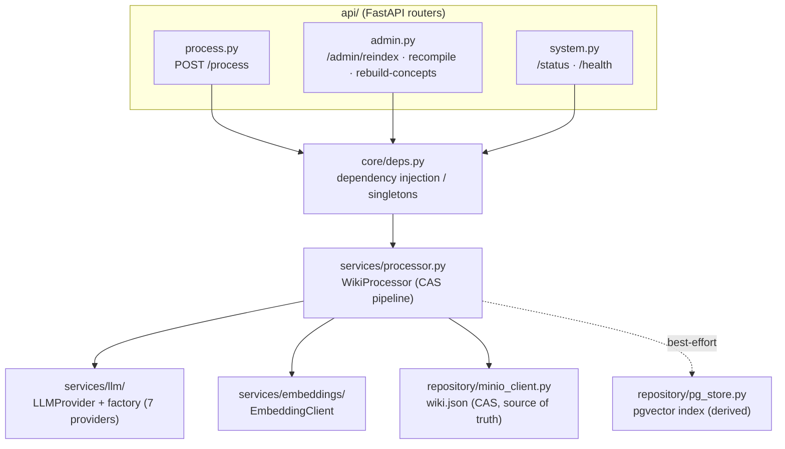
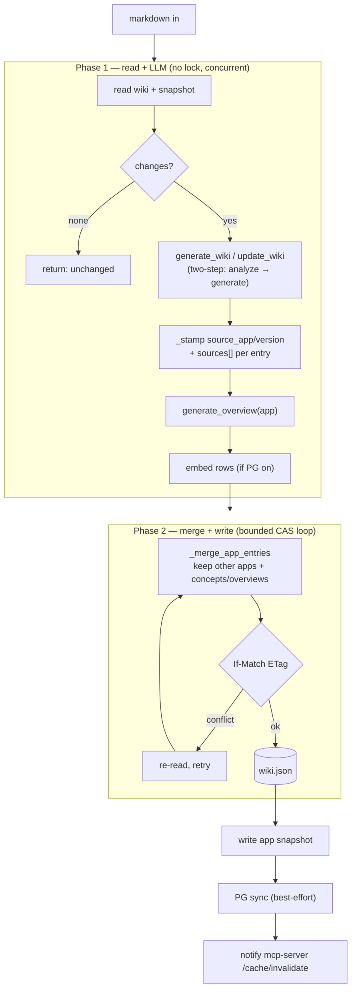

# wiki-processor — architecture

Ingestion + indexing service. Layered: `api/` (HTTP) → `core/` (DI) →
`services/` (logic) → `repository/` (MinIO + PG).

## Internal layering

## /process pipeline (two-phase, multi-replica safe)

See [`docs/concurrency.md`](../concurrency.md) for the CAS contract,
[`docs/llm-provider-abstraction.md`](../llm-provider-abstraction.md) for the LLM
layer, and [`docs/api.md`](../api.md) for endpoints.
